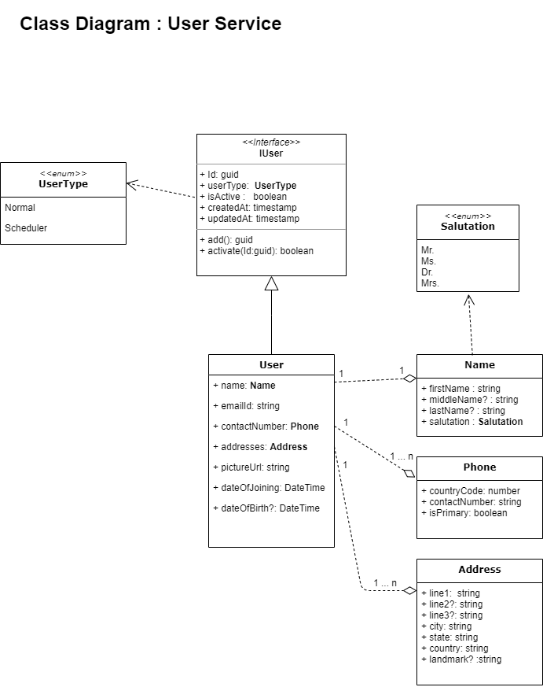

# User Service
This is the documentation for the service.

## Purpose
This API is used to manage the user related details, which includes :
* Basic details
* Delivery Addresses

## Dependencies
The Authentication is handled by `API Gateway`.

## Assumptions

_NA_

## Technology stack
* [NestJS] - NodeJS API framework 
* [MongoDB] - Database
* [Jest] and [Supertest] - Testing Framework

## Steps to Run and commands available for use
 Clone this repository using `git clone` command and run the following commands. Below commands assume that you are using `yarn` as package manager. If you are using `npm` commands will be _similar_. See [npm-yarn-cheatsheet]

    $ cd user-service

 #### Install all dependencies
    $ yarn  
 #### Run Unit Tests
    $ yarn test:unit
 #### Run Integration Tests
    $ yarn test:integration
 #### Run Code Coverage  
    $ yarn test:coverage
#### Run the Service on localhost
    $ yarn start 
The Service should be available at `http:\\localhost:3001`.

The Swagger documentation should be available at `http:\\localhost:3001\docs`

## Todos
* Token should be validated from `API- Gateway`

[//]: #

   [npm-yarn-cheatsheet]: <https://www.digitalocean.com/community/tutorials/nodejs-npm-yarn-cheatsheet>
   [NestJS]:<https://docs.nestjs.com/>
   [MongoDB]:<https://www.mongodb.com/>
   [Jest]:<https://github.com/facebook/jest> 
   [Supertest]:<https://github.com/visionmedia/supertest>
